# ClinicOS — Phase roadmap & delivery sheet

**Purpose:** One place to track progress against `docs/ClinicOS_Architecture_Document.pdf` and `docs/ClinicOS_Architecture_Diagram.png`, without re-explaining the plan every time. **Update the Status column when something ships.** For AI/code reviews, paste: *“Follow `docs/PHASE_ROADMAP.md`.”*

**Primary codebase:** `backend/` (Laravel) — this is what you version and deploy.

---

## Git ? live server (read this once)

| What you might assume | What is actually true |
|------------------------|------------------------|
| “Push to Git ? live updates automatically” | **Only if** you configure **CI/CD** (e.g. GitHub Actions ? deploy to AWS Elastic Beanstalk / EC2 / ECS, or CodePipeline). A bare `git push` does **nothing** to AWS by itself. |
| Typical minimal setup | **Git** = source of truth. **Server** = `git pull` + `composer install` + `php artisan migrate` + `php artisan config:cache` + `php artisan view:clear` (or your playbook). |
| AWS | Point **one** pipeline (or one documented script) to the same branch (e.g. `main`) so every merge is repeatable. |

**Action item:** Add a short `docs/DEPLOY.md` later with your exact AWS path (optional).

---

## How to use this doc (save time / tokens)

1. **After each release:** Move items from ? ? ? and add **one line** under *Last updated*.
2. **In chats:** Say *“Status is in PHASE_ROADMAP.md Phase X”* instead of pasting logs again.
3. **Code review:** Reviewers check only the phase marked *In progress*.

**Last updated:** 2026-04-05 — initial sheet; aligns PDF §1–6 + OPD flow with `backend/` reality.

---

## Phase dependency (high level)

```mermaid
flowchart LR
  P0[Phase 0 Git and deploy]
  P1[Phase 1 Foundation]
  P2[Phase 2 Reception and scheduling]
  P3[Phase 3 Triage or nurse]
  P4[Phase 4 Doctor EMR]
  P5[Phase 5 Lab]
  P6[Phase 6 Pharmacy]
  P7[Phase 7 Billing and discharge]
  P8[Phase 8 WhatsApp and admin MIS]
  P9[Phase 9 ABDM M1]
  P10[Phase 10 FHIR and M2 HIP]
  P0 --> P1 --> P2 --> P3 --> P4 --> P5 --> P6 --> P7 --> P8
  P8 --> P9 --> P10
```

Later PDF sections (certification, full FHIR store, wrapper) sit in **Phase 9+**.

---

## Mapping: PDF sections ? phases

| PDF | Topic | Phases here |
|-----|--------|-------------|
| §1 System overview | Principles, federated / consent / India security | Spread across all; **§1 done** = product + legal posture documented |
| §2 Architecture layers | L1 UI, L2 API, L3 ABDM, L4 data, L5 external | **Phase 1–8** = L1/L2/L4/L5 *product*; **9+** = L3 + full L4 FHIR |
| §3 OPD flow Steps 1–6 | Arrival ? … ? billing/discharge | **Phase 2–7** |
| §4 ABDM roadmap | M1, M2, M3, WASA | **Phase 9–12** |
| §5 Modules | 5.1–5.9 specs | Rows inside **Phase 2–8** |
| §6 Tech stack | Flutter, Next, Laravel, HAPI, Mongo, etc. | **Phase 1** = Laravel+MySQL baseline; **9+** = add Wrapper/HAPI/Mongo as deployed services |

---

## Phase 0 — Repository & deployment pipeline

| # | Deliverable | Status | Notes |
|---|-------------|--------|--------|
| 0.1 | Remote Git repo (GitHub/GitLab) for `backend/` | ? | |
| 0.2 | Branch strategy (e.g. `main` = deployable) | ? | |
| 0.3 | AWS target chosen (EC2 / EB / Lightsail / ECS) | ? | |
| 0.4 | Automated or documented deploy (CI or runbook) | ? | Push alone ? deploy |
| 0.5 | Env vars & secrets not in Git | ? | `.env` on server / Secrets Manager |

---

## Phase 1 — Foundation (PDF §1–2, §6 baseline)

| # | Deliverable | Status | Notes |
|---|-------------|--------|--------|
| 1.1 | Laravel app + MySQL multi-tenant `clinic_id` | ? | Core pattern in codebase |
| 1.2 | Auth + role middleware (`owner`, `doctor`, `receptionist`, …) | ? | `CheckRole`, routes |
| 1.3 | REST/API surface where needed (Sanctum/API routes) | ?? | Web-first; APIs vary by module |
| 1.4 | Logging / health endpoint | ? | e.g. `/health`, `Log::` usage |

**Definition of done:** New clinic can log in, data is scoped by clinic, no cross-clinic leakage.

---

## Phase 2 — Registration & scheduling (PDF §3 Step 1 part, §5.1–5.2)

| # | Deliverable | Status | Notes |
|---|-------------|--------|--------|
| 2.1 | Patient register / search | ? | Patients module |
| 2.2 | Appointments (book, list, statuses) | ? | |
| 2.3 | OPD queue / token / walk-in | ? | `OpdController`, queue views |
| 2.4 | ABHA QR / M1 registration flows | ? | **Later — Phase 9** |
| 2.5 | Dedup / UHID rules per clinic policy | ?? | Confirm product rules |

---

## Phase 3 — Triage / nurse (PDF §3 Step 2)

| # | Deliverable | Status | Notes |
|---|-------------|--------|--------|
| 3.1 | Vitals capture (BP, weight, temp, SpO2, pulse) | ?? | Depends on EMR/specialty screens |
| 3.2 | Pre-consult “ready for doctor” status | ?? | Tie to queue/appointment status |
| 3.3 | FHIR Observation bundle export | ? | **Phase 10+** |

---

## Phase 4 — Doctor EMR (PDF §3 Step 3, §5.3)

| # | Deliverable | Status | Notes |
|---|-------------|--------|--------|
| 4.1 | Visit/EMR per appointment; specialty templates | ? | `EmrWebController`, templates |
| 4.2 | Prescription + Indian drug search | ? | Fixes per `PRODUCTION_FLOW_STATUS.md` |
| 4.3 | Voice / AI assist | ?? | Where integrated |
| 4.4 | SNOMED/ICD browser “as in PDF” | ?? | Depth varies |
| 4.5 | HPR digital sign-off | ? | **ABDM-related** |
| 4.6 | Finalise ? sensible redirect (e.g. EMR index) | ? | Documented |

---

## Phase 5 — Laboratory & radiology (PDF §3 Step 4, §5.4)

| # | Deliverable | Status | Notes |
|---|-------------|--------|--------|
| 5.1 | Lab order from consultation | ?? | Lab controllers/routes |
| 5.2 | Lab tech workflow + result entry | ?? | |
| 5.3 | PDF report + WhatsApp delivery | ?? | WhatsApp service |
| 5.4 | LOINC + FHIR DiagnosticReport | ? | **Phase 10+** |

---

## Phase 6 — Pharmacy (PDF §3 Step 5, §5.5)

| # | Deliverable | Status | Notes |
|---|-------------|--------|--------|
| 6.1 | Rx ? pharmacy queue / dispensing | ?? | |
| 6.2 | Stock, batch, expiry | ?? | |
| 6.3 | Billing link for pharmacy lines | ?? | |
| 6.4 | FHIR MedicationDispense | ? | **Phase 10+** |

---

## Phase 7 — Billing & discharge (PDF §3 Step 6, §5.6)

| # | Deliverable | Status | Notes |
|---|-------------|--------|--------|
| 7.1 | GST invoices / SAC awareness | ?? | Billing module |
| 7.2 | Razorpay / UPI / payment links | ?? | |
| 7.3 | Consolidated invoice (OPD + lab + pharmacy) | ?? | Product rule |
| 7.4 | AB-PMJAY / TPA | ? | If in scope |
| 7.5 | Discharge summary + DocumentReference | ?? | **Full FHIR later** |

---

## Phase 8 — WhatsApp, AI, admin MIS (PDF §5.8–5.9, diagram L5)

| # | Deliverable | Status | Notes |
|---|-------------|--------|--------|
| 8.1 | WhatsApp reminders / outbound | ?? | `WhatsAppWebController`, Meta API |
| 8.2 | Dashboard KPIs / analytics | ?? | `DashboardController` (fix GROUP BY query if needed) |
| 8.3 | HMIS export / one-click upload | ? | Often CSV/report |
| 8.4 | Next.js admin / patient portal (PDF L1) | ? | **Optional parallel track** |

---

## Phase 9 — ABDM M1 (PDF §4.2 M1, §5.1 ABHA)

| # | Deliverable | Status | Notes |
|---|-------------|--------|--------|
| 9.1 | Sandbox credentials + HFR | ? | |
| 9.2 | ABHA create/verify + demographics fetch | ? | Partial code may exist |
| 9.3 | Scan-and-share / QR flows | ? | |

---

## Phase 10 — FHIR store + M2 HIP (PDF §2.2 FHIR, §4.2 M2, §8)

| # | Deliverable | Status | Notes |
|---|-------------|--------|--------|
| 10.1 | HAPI FHIR R4 (or approved store) deployed | ? | Separate service in arch doc |
| 10.2 | NHA ABDM Wrapper (Spring) + Mongo | ? | As per PDF |
| 10.3 | Care context + 5 record types quality bar | ? | NHA tester expectations |

---

## Phase 11 — M3 HIU + longitudinal records (PDF §4.2 M3)

| # | Deliverable | Status | Notes |
|---|-------------|--------|--------|
| 11.1 | Consent request / receive external FHIR | ? | |
| 11.2 | Patient timeline from network | ? | |

---

## Phase 12 — Security & go-live (PDF §4.2 M4, §7)

| # | Deliverable | Status | Notes |
|---|-------------|--------|--------|
| 12.1 | WASA / VAPT with CERT-IN empanelled agency | ? | |
| 12.2 | Production ABDM credentials | ? | After milestones |

---

## Legend

| Symbol | Meaning |
|--------|--------|
| ? | Done / acceptable for current rollout |
| ?? | Partially done — verify in QA |
| ? | Not done / future phase |

---

## Related docs

- `docs/PRODUCTION_FLOW_STATUS.md` — recent bugfixes and clinical-flow notes  
- `docs/ClinicOS_Architecture_Document.pdf` — full module + ABDM spec  
- `docs/ClinicOS_Architecture_Diagram.png` — layer diagram  

---

## Changelog

| Date | Change |
|------|--------|
| 2026-04-05 | Initial roadmap sheet; statuses are best-effort snapshot — **edit as you ship**. |
